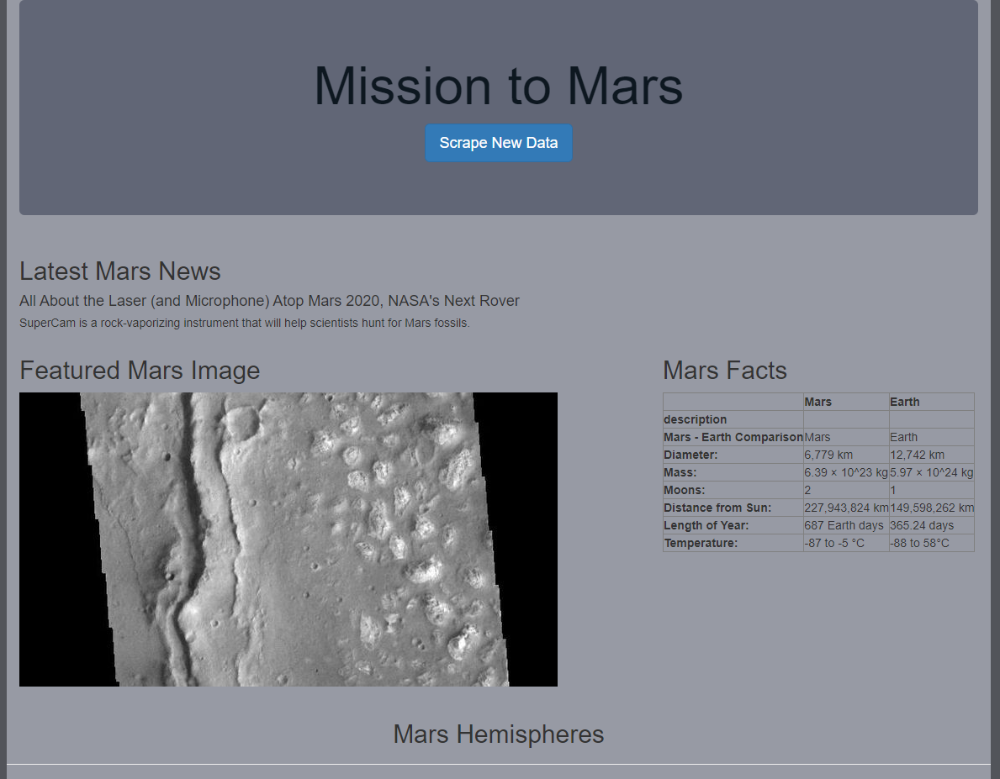

# Mission to Mars Flask App
## Project Overview
The purpose of this project is to create a locally-hosted webpage through Flask using the [app.py](app.py) file, and then display data gathered through web-scrapping of several space-related websites. The Flask app runs scraping functions found in [scraping.py](scraping.py) and stores the returned data in a MongoDatabase, and then displays the Mongodb data following an [html template](templates/index.html) to finish creating the website. The website displays news snippets about Mars, a featured image of Mars from https://spaceimages-mars.com, a table of Mars facts, and labeled images of Mars' hemispheres. At the top of the page is a "Scrape" button that runs the `scrape_all()` function and displays up-to-date news and images.

